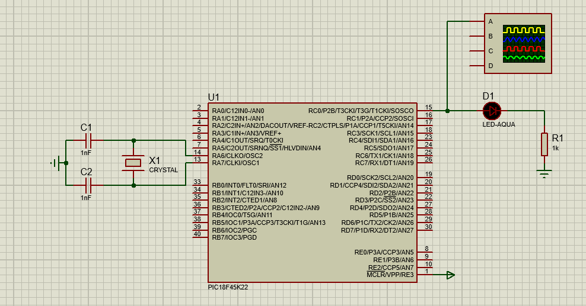
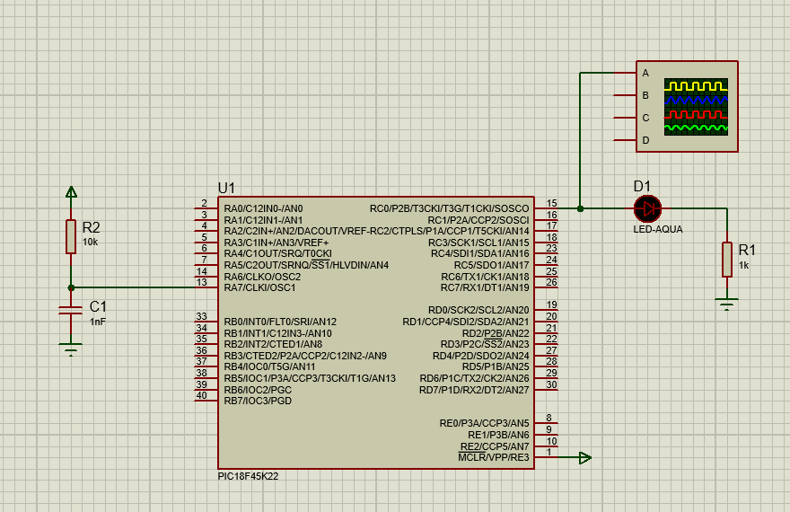
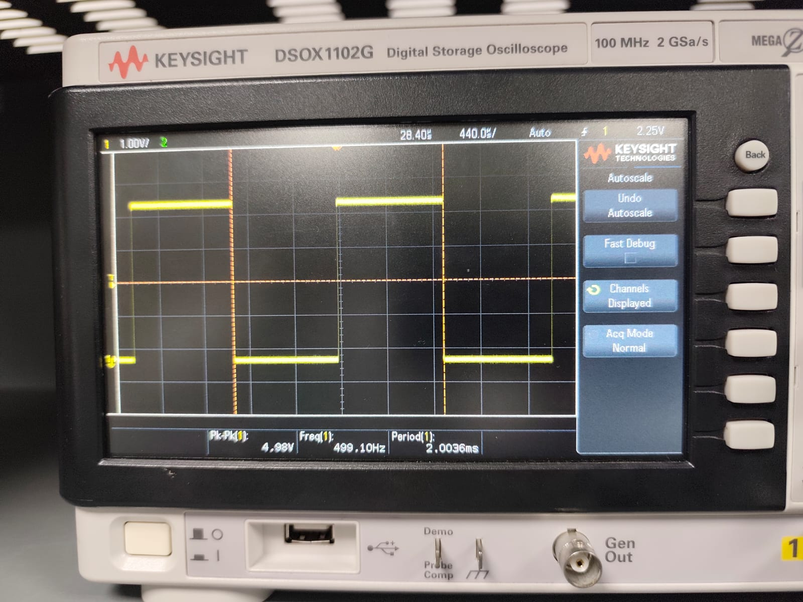
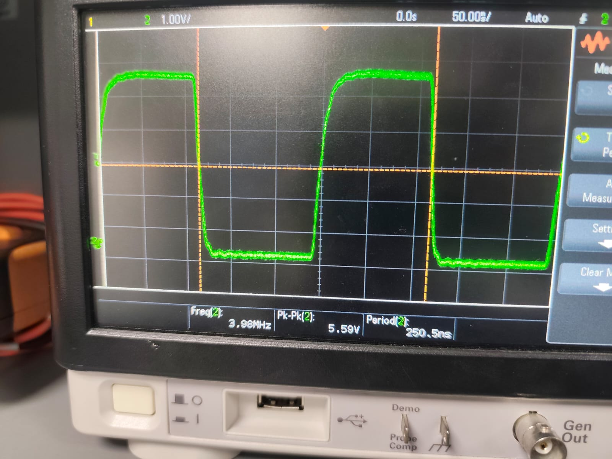
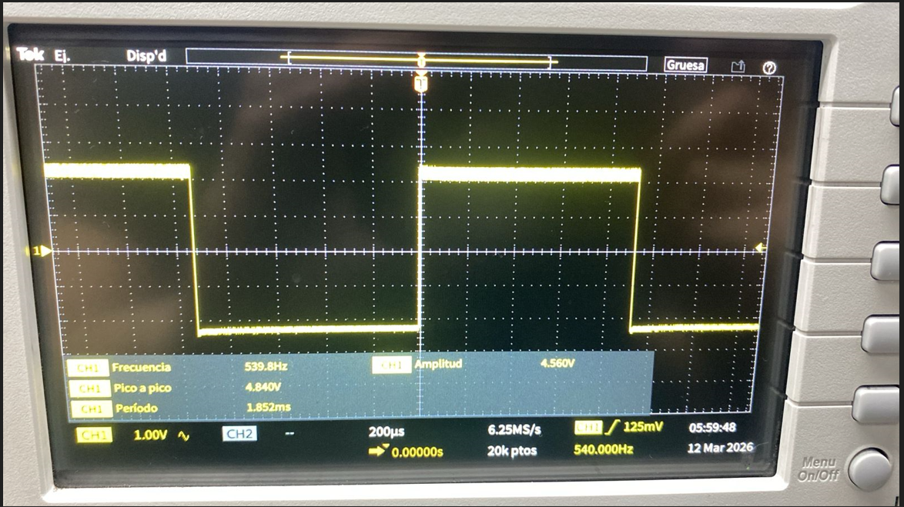
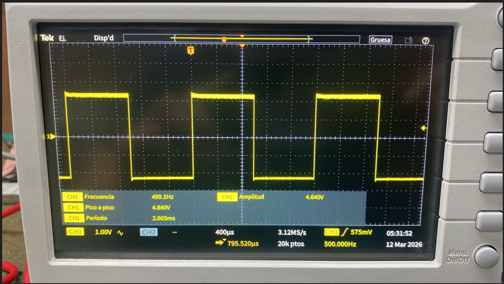
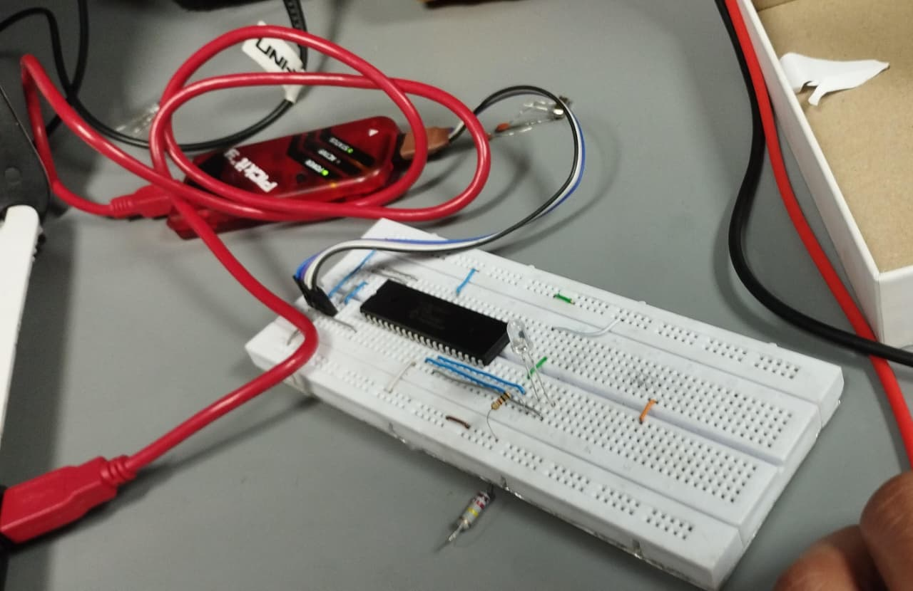
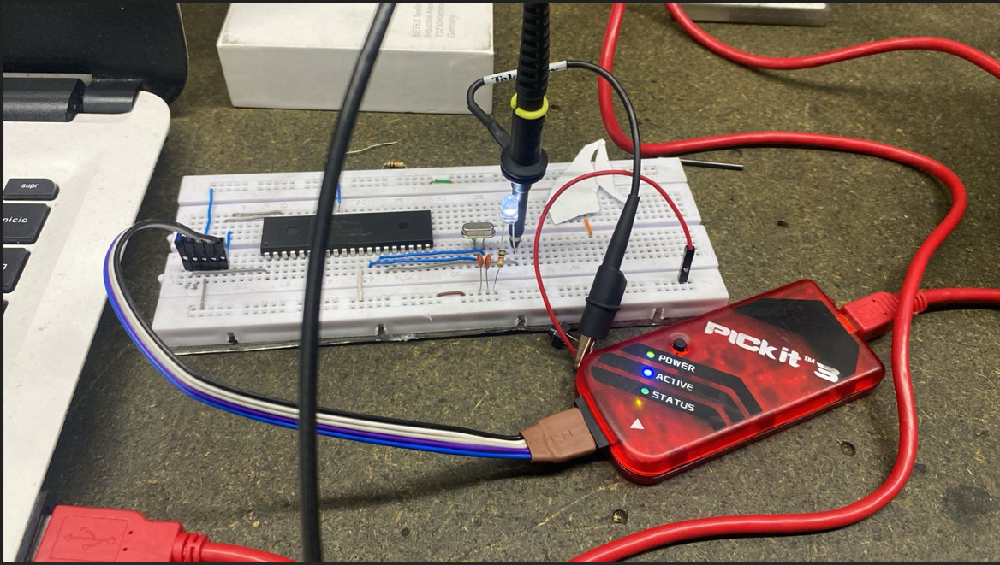
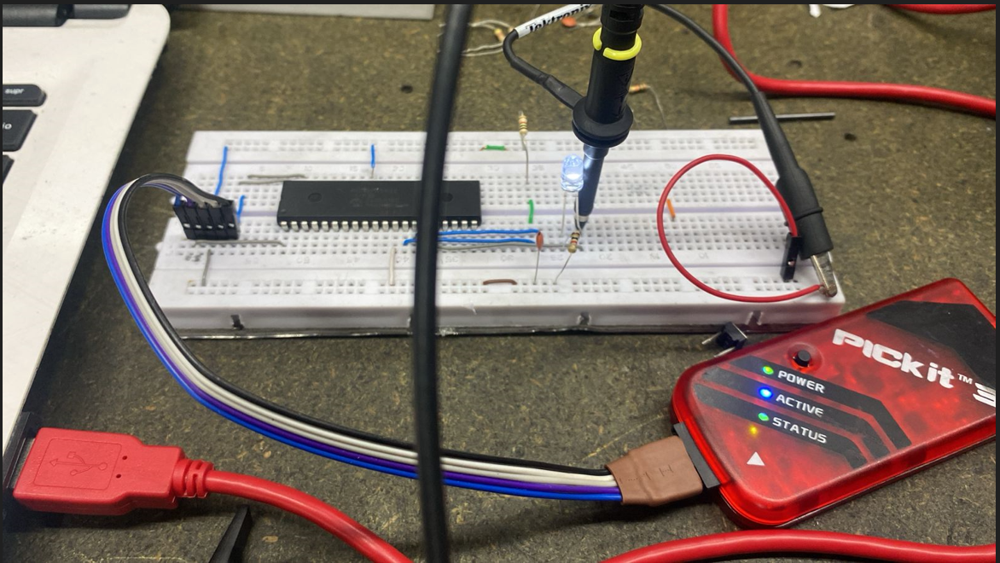

[](https://classroom.github.com/a/KzqfxGd5)
[](https://classroom.github.com/online_ide?assignment_repo_id=22821779&assignment_repo_type=AssignmentRepo)
# Lab02 - Caracterización de osciladores (externo vs. interno)


## 1. Integrantes

* [EDWARD ALEXANDER RODRIGUEZ](https://github.com/Edwardrodriguez99)
* [JUAN CAMILO SAMPER](https://github.com/CamiloSp22)
* [CRISTIAN FABIAN LOZANO](https://github.com/cristianfalozanoav)

## 2. Documentación

En cualquier sistema digital, el reloj es el elemento que sincroniza todas las operaciones. Sin una señal periódica estable, el sistema no puede ejecutar instrucciones de manera ordenada ni mantener coherencia temporal.

El oscilador es, por tanto, es el corazón del sistema, ya que determina la frecuencia a la que se ejecutan las instrucciones y la velocidad de operación. La elección del tipo de oscilador influye directamente en:

* Precisión de temporización

* Estabilidad del sistema

* Consumo energético

* Costo del diseño

* Complejidad del circuito

En este laboratorio se compararán dos tipos de osciladores: el oscilador interno y el oscilador externo tipo RC. Antes de analizar sus diferencias y resultados, es importante comprender con mayor detalle qué es un oscilador.

**¿Qué es un oscilador?**

Un oscilador es un circuito que genera una señal repetitiva en el tiempo. En sistemas digitales esa señal actúa como reloj. Cada pulso indica cuándo se debe ejecutar una operación.

La frecuencia del oscilador determina la velocidad del sistema. Por ejemplo, si el reloj trabaja a mayor frecuencia, el sistema puede ejecutar más instrucciones por segundo. Si la frecuencia es baja, el sistema será más lento.

Además, muchas funciones dependen directamente del reloj, como:

* Los retardos por software (delay_ms)

* Los temporizadores

* La comunicación serial

* La generación de señales PWM

**Oscilador interno**


El oscilador interno viene integrado dentro del microcontrolador. No necesita resistencias, capacitores ni cristales externos. Se configura por software y permite trabajar a distintas frecuencias.

**¿Qué ventajas tiene?**

* Es fácil de usar.

* No requiere componentes adicionales.

* Reduce el costo del circuito.

* Es bastante estable para la mayoría de aplicaciones.

**Oscilador externo cristal de cuarzo**


El oscilador Externo de cristal de cuarzo es un material que cuando le aplicas electricidad, vibra  a una frecuencia determinada por el fabricante.

Aunque la mayoría de los microcontroladores tienen un oscilador interno, el externo es preferido por tres razones simples:

* Precisión extrema: El interno es como un reloj de pared barato que se atrasa; el externo es como un cronómetro profesional.

* Inmune al clima: El interno falla si hace mucho calor o frío. El cristal externo mantiene el mismo ritmo sin importar la temperatura.

* Sincronización: Si necesitas que dos dispositivos se entiendan perfectamente (como en puertos USB o Bluetooth), ambos deben seguir el mismo ritmo exacto que solo un oscilador externo puede dar.

**Oscilador externo RC**


El oscilador RC externo utiliza una resistencia (R) y un capacitor (C) conectados a los pines de reloj del sistema para generar la señal periódica. La frecuencia generada depende de los valores de estos dos componentes y puede estimarse con la fórmula aproximada:

f ≈ 1 / (4RC)

Esto dandonos a entender que cualquier cambio en la resistencia o el capacitor altera directamente la frecuencia del sistema. A diferencia del oscilador interno, aquí la estabilidad depende de factores físicos externos.

### 2.1 Descripción del laboratorio

Este laboratorio tiene como objetivo comparar el comportamiento de diferentes configuraciones que pueden emplearse para implementar un oscilador. Para ello, se realizarán los cálculos teóricos correspondientes a cada configuración y posteriormente se contrastarán con los resultados obtenidos en la práctica.

El propósito de esta comparación es evaluar qué tan precisos son los resultados experimentales con respecto a los cálculos realizados. Además, se analizará el comportamiento de las señales generadas mediante el uso del osciloscopio, lo que permitirá observar y estudiar las características de cada configuración de oscilador.

### 2.2 Explicación del código implementado

Una vez comprendido el papel del oscilador dentro del sistema y su influencia en la velocidad y sincronización del microcontrolador, es importante analizar cómo estas configuraciones se implementan a nivel de programación. Para ello, a continuación se presenta el código desarrollado para este laboratorio, en el cual se realiza la configuración del microcontrolador y del tipo de oscilador utilizado. Además, se explicará el funcionamiento de cada una de las secciones del programa, con el fin de entender cómo el código permite controlar el comportamiento del sistema y ejecutar las instrucciones de manera adecuada durante la práctica.

En la primera parte del código se pueden observar las siguientes instrucciones:


En esta sección se incluyen las primeras líneas del programa, cuya función es incorporar las librerías necesarias para la correcta compilación y ejecución del código. El comando ```#include <xc.h>``` permite acceder a las definiciones y configuraciones propias del compilador, en este caso es el compilador XC8. Por otro lado, la librería ```#include <stdint.h>``` proporciona tipos de datos enteros de tamaño definido, lo que ayuda a manejar la memoria de forma más controlada y evita posibles desbordamientos de datos durante la ejecución del programa.

Una vez incorporadas las librerías necesarias, la siguiente parte del código se encarga de realizar la configuración inicial del sistema, permitiendo establecer los parámetros que controlarán el funcionamiento del microcontrolador durante la ejecución del programa.


Para comprender cómo funcionan estas configuraciones iniciales del sistema, es necesario analizar a qué corresponde cada una de las instrucciones presentes en el código. En este caso, varias de ellas comienzan con la palabra ```#Pragma```, la cual se utiliza para indicarle al compilador que debe aplicar ciertas configuraciones al microcontrolador antes de generar el programa final. Dicho de otra forma, estas instrucciones permiten definir algunos parámetros internos que determinan cómo se comportará el sistema cuando el programa empiece a ejecutarse.

En particular, las instrucciones que utilizan ```#pragma config``` permiten establecer lo que se conoce como bits de configuración del microcontrolador. Estos bits controlan diferentes aspectos del funcionamiento del dispositivo, como la activación o desactivación de ciertos módulos internos, opciones de protección del programa o mecanismos que ayudan a mantener estable el funcionamiento del sistema.

A continuación, se describen brevemente algunas de las configuraciones utilizadas en el código implementado:

* ```#pragma config WDTEN = OFF```
Esta configuración desactiva el Watchdog Timer, un temporizador interno que supervisa el funcionamiento del programa. Cuando este temporizador está activo, el microcontrolador puede reiniciarse automáticamente si detecta que el programa se ha detenido o no está respondiendo correctamente. En este caso se desactiva para evitar reinicios durante el desarrollo del laboratorio.

*  ```#pragma config LVP = OFF```
Esta instrucción desactiva el modo de programación a bajo voltaje. Este modo permite programar el microcontrolador utilizando una tensión menor en uno de sus pines, pero también puede interferir con el uso normal de ese pin dentro del circuito. Por esta razón, cuando no se necesita utilizar esta forma de programación, se suele deshabilitar.

* ```#pragma config PBADEN = OFF```
Define el comportamiento inicial de algunos pines del puerto B. Cuando esta opción está desactivada, dichos pines funcionan directamente como entradas o salidas digitales, lo cual facilita su uso para controlar dispositivos como LEDs o leer el estado de interruptores.

* ```#pragma config CP0 = OFF, CP1 = OFF, CP2 = OFF, CP3 = OFF```
Estas configuraciones están relacionadas con la protección del código almacenado en la memoria del microcontrolador. Cuando están activadas, impiden que el programa sea leído o copiado desde el dispositivo. En este caso se mantienen desactivadas, lo cual permite acceder al código sin restricciones durante las pruebas y el desarrollo.

* ```#pragma config BOREN = OFF```
Esta opción controla la función de reinicio por caída de voltaje. Cuando está activada, el microcontrolador se reinicia automáticamente si la tensión de alimentación cae por debajo de un nivel seguro. En este laboratorio se desactiva para simplificar el comportamiento del sistema durante la simulación.

* ```#pragma config FCMEN = OFF```
Esta configuracion corresponde a un mecanismo que supervisa el funcionamiento del reloj del sistema. Si el reloj principal falla, el microcontrolador puede cambiar automáticamente a otro reloj interno para evitar que el sistema se detenga. En este caso se desactiva porque no es necesario para el funcionamiento básico del laboratorio.

* ```#pragma config IESO = OFF```
Esta configuración está relacionada con el cambio automático entre el oscilador interno y el externo durante el arranque del sistema. Cuando está habilitada, el microcontrolador puede iniciar utilizando el oscilador interno mientras el oscilador externo se estabiliza. En este laboratorio se desactiva para mantener un comportamiento más simple y controlado del reloj del sistema.

Una vez establecidas las configuraciones generales del microcontrolador, el siguiente paso dentro del código consiste en definir el modo de oscilador que utilizará el sistema. Como se mencionó anteriormente, el oscilador es el encargado de generar la señal de reloj que sincroniza la ejecución de las instrucciones, por lo que su configuración tiene una influencia directa en la velocidad y el comportamiento del sistema.

En el código implementado se incluyó una sección que permite seleccionar entre diferentes tipos de oscilador, lo que facilita realizar pruebas y comparar su funcionamiento sin necesidad de modificar gran parte del programa. Para ello se utiliza una constante llamada ```MODE```, la cual determina qué tipo de oscilador será configurado durante la compilación.


* ```if MODE == 1```
Establece que cuando mi constante ```MODE``` sea 1, el sistema se configura para utilizar el oscilador interno del microcontrolador. Ademas de usar la directiva ```#pragma config FOSC = INTIO7 ``` para indicar que el oscilador empleado sera el interno; y la directiva ```USE_PLL = 0``` para no emplear el multiplicador de frecuencia.

* ```if MODE == 2 ```
Cuando la constante ```MODE``` sea 2, el microcontrolador se configura para trabajar con un cristal externo de alta velocidad (```#pragma config FOSC = HSHP```).
En este caso se emplea la directiva ```#pragma config PLLCFG = ON``` que activa el multiplicador de frecuencia PLL, el cual permite aumentar la frecuencia del reloj multiplicándola internamente y finalmente se establece ```USE_PLL = 1``` para emplear el multiplicador de frecuencia.

* ```if MODE == 3 ```
Cuando en este modo la constante ```MODE``` sea 3, el sistema configurará el microcontrolador para trabajar con un oscilador RC externo. Esto se define mediante la instrucción ```#pragma config FOSC = RC```, que indica al hardware que el reloj del sistema se obtendrá de un circuito formado por una resistencia y un condensador conectados externamente.
En este mismo bloque también se define``` USE_PLL``` con valor 0, lo que significa que el multiplicador de frecuencia PLL no se utilizará en este modo.
Finalmente, en esta sección del código se implementa una línea de código, la cual establece que, si el valor de ```MODE``` no coincide con ninguno de los modos definidos en el programa, el compilador mostrará un error indicando que el modo de oscilador es inválido. Esto sirve como una especie de protección para evitar compilar el programa con una configuración incorrecta.

**Definición de Frecuencia del oscilador**


En esta parte se define la constante``` _XTAL_FREQ```, que representa la frecuencia a la que trabaja el microcontrolador.
Esta constante es muy importante porque el compilador la utiliza para calcular correctamente los tiempos de las funciones de retardo como __delay_ms().
El código contempla varias situaciones. Si el programa está funcionando en los modos 1 o 2, primero se revisa si el PLL está habilitado. Si el PLL está activo, la frecuencia del sistema se multiplica y llega a 64 MHz. Si el PLL no está habilitado, la frecuencia se mantiene en 16 MHz.

**Division de funciones**


En esta sección del código se definen varias funciones, entre ellas se encuentra la siguiente función que se muestra, esta permite generar retardos en milisegundos.
La función ```delay_ms``` recibe como parámetro una variable que indica la cantidad de milisegundos que se desea esperar. Internamente se utiliza un ciclo while que se ejecuta hasta que el contador llega a cero.
En cada iteración del ciclo se llama a la función ```__delay_ms(1)```, que produce un retardo de un milisegundo. De esta forma, si se llama a la función con un valor de 10, el programa generará un retardo total de aproximadamente 10 milisegundos.

* ```Establecimiento de pines```

Antes de utilizar los pines del microcontrolador, es necesario configurarlos correctamente como entradas o salidas. Para este propósito se define la función init_pins.


En este caso se configura el pin RC0 como salida digital. Esto se realiza modificando el registro TRISC, donde un valor de 0 indica que el pin funcionará como salida.
Posteriormente se utiliza el registro LATC para establecer el estado inicial del pin, colocándolo en nivel bajo. Esto asegura que el pin comience en un estado conocido cuando el programa se ejecute.

Dentro de la misma función de inicialización de pines, se incluye una condición para configurar el pin RA6 solo cuando el modo de funcionamiento lo permite.
En este fragmento se verifica si el sistema está trabajando en un modo que permite utilizar el pin RA6 como salida. Si la condición se cumple, el pin se configura como salida digital y se inicializa en nivel bajo.

* ```Oscilador```

Una vez configurados los pines, el siguiente paso consiste en preparar el sistema de reloj del microcontrolador. Esto se realiza mediante la función ```init_oscillator```.


En este bloque se configura el registro ```OSCCON```, que controla diferentes aspectos del oscilador interno del microcontrolador. El campo ```IRCF``` se establece en el valor 0b111, lo que indica que el oscilador interno operará a una frecuencia de 16 MHz.
Posteriormente se configura el campo ```SCS```, el cual determina la fuente de reloj del sistema. En este caso se selecciona el oscilador primario como fuente principal.

* ```PLL```

En esta sección se verifica si el PLL debe activarse o mantenerse desactivado.


Si el valor de ```USE_PLL``` es igual a 1, el programa habilita el PLL mediante el registro ```OSCTUNE```. Esto permite multiplicar la frecuencia del reloj del sistema.
En caso contrario, el programa se asegura de que el PLL permanezca desactivado.
Esto ayuda a evitar configuraciones innecesarias o posibles conflictos en el funcionamiento del sistema.

**Programa principal**

Para finalizar abarcaremos el programa principal, el cual, tiene como punto de inicio la función main.}


En esta parte del código se llaman primero las funciones encargadas de inicializar los pines y el oscilador. Esto garantiza que el microcontrolador esté correctamente configurado antes de ejecutar la lógica principal del programa.
Posteriormente el programa entra en un bucle infinito donde se ejecuta la tarea principal del sistema.
Dentro de este ciclo el pin RC0 cambia constantemente de estado. Primero se establece en nivel alto y se mantiene así durante un milisegundo. Luego se coloca en nivel bajo durante otro milisegundo.
Este proceso se repite continuamente, generando una señal cuadrada en el pin RC0. Debido a que cada ciclo completo dura aproximadamente dos milisegundos, la señal resultante tiene una frecuencia cercana a 500 Hz.
Esta señal puede utilizarse para diferentes aplicaciones, como el parpadeo de un LED, la generación de señales de prueba o la verificación del funcionamiento del sistema de reloj del microcontrolador.


### 2.3 Análisis y comparación

#### Tabla 1: Medición en frío

| Modo de oscilador | Freq. teórica Fosc | RA6 medible (CLKO)? | Freq. medida RA6 (Hz) | Freq. teórica RC0 (Hz)| Freq. medida RC0 (Hz) | Error RC0 (%) |  
|------------------|------------------|---------------------|---------------|---------------------|---------------|---------------|
| INTOSC (interno) | 16,000,000       | Sí                 |   4 MHz      | 500   | 497 Hz              |   0,6 %            | |
| HS (cristal externo 16 MHz) | 16,000,000 | No |     NA      |               500                 |      499 Hz         |       0,2 %        |
| RC externo       | ~7,570,000*     | Si                                    |       2,079 MHz        | 500                 |  539 Hz             |      7,8 %         | |


#### Tabla 2: Medición con calor

| Modo de oscilador | Freq. teórica Fosc | RA6 medible (CLKO)? | Freq. medida RA6 (Hz) | Freq. teórica RC0 (Hz)| Freq. medida RC0 (Hz) | Error RC0 (%) |  
|------------------|------------------|---------------------|---------------|---------------------|---------------|---------------|
| INTOSC (interno) | 16,000,000       | Sí                 | 4 Mhz                    |                500                 |    494 Hz           |    1,2 %           | |
| HS (cristal externo 16 MHz) | 16,000,000 | No |     NA      |               500                 | 499 Hz              |    0,2 %           |
| RC externo       | ~16,000,000*     | No                                    |       N/A        | 500                 | 510 Hz               |  2,0 %              | |

#### Tabla 3: Deriva

| Modo de oscilador |RC0 deriva (Hz) |
|------------------|--------------------|
| INTOSC (interno) |        3 Hz            |                
| HS (cristal externo 16 MHz) |   0,02 Hz              |                |
| RC externo       |         39 Hz        |                

**Analisis Tablas 1 y 2**

Al comparar la "Tabla 1" (frío) con la "Tabla 2" (calor), podemos sacar conclusiones muy claras sobre la estabilidad térmica de cada tipo de oscilador:

* HS (Cristal externo - 16 MHz): El más estable:
El cristal externo demuestra ser la opción más robusta y confiable. El error se mantiene constante en un 0.2% independientemente de si el microcontrolador está frío o caliente. Esto es característico de los cristales de cuarzo, que tienen una excelente estabilidad térmica.

* INTOSC (Oscilador interno): Sensible a la temperatura:
En frío, tiene un error bastante aceptable del 0.6%. Sin embargo, al aplicar calor, el error se duplica al 1.2% (la frecuencia cae de 497 Hz a 494 Hz). Esto demuestra que las redes de resistencias y capacitores integradas dentro del silicio del microcontrolador varían sus valores con la temperatura, afectando la frecuencia del reloj. Es útil para aplicaciones generales, pero no para medidas de tiempo de alta precisión.

* RC externo (Resistencia-Capacitor): El más impreciso y variable:
Este modo presenta los errores más altos. En frío tiene un error significativo del 7.8%. Curiosamente, al calentarse, el error se reduce al 2.0%. Esta drástica variación térmica ocurre porque los componentes discretos (resistencias y capacitores) tienen coeficientes de temperatura que alteran su valor físico con el calor. El hecho de que mejorara con el calor en tu prueba depende puramente de los coeficientes específicos de los componentes que usaste, pero reafirma que es el modo menos confiable para aplicaciones críticas.

Como se observa en el modo INTOSC, la frecuencia en el pin RA6 (CLKO) es exactamente una cuarta parte de la frecuencia del oscilador principal (16 MHz / 4 = 4 MHz). Esto confirma que el microcontrolador necesita 4 ciclos de reloj para ejecutar una instrucción (ciclo de máquina).

**Analisis Tablas 3**

Si tomamos en cuenta que la frecuencia teórica esperada en el pin RC0 es de 500 Hz, podemos observar lo siguiente:
* HS (Cristal externo 16 MHz): Estabilidad absoluta. Con una deriva de apenas 0,02 Hz. Esto confirma por qué los cristales de cuarzo son el estándar de la industria cuando necesitas precisión estricta (por ejemplo, para comunicación serial a altas velocidades, relojes en tiempo real o medición de señales).
* INTOSC (Oscilador interno): Variación moderada Presenta una deriva de 3 Hz (lo que representa una variación del $0.6\%$ sobre los 500 Hz teóricos). Es una desviación notable en comparación con el cristal, pero completamente aceptable para la mayoría de aplicaciones generales donde la precisión extrema no es crítica (como leer botones, encender pantallas o temporizadores básicos). Su gran ventaja es que ahorra componentes externos y pines.
* RC externo (Resistencia-Capacitor): Altamente inestableCon una deriva de 39 Hz, este es, con mucha diferencia, el oscilador más errático. Una fluctuación de casi el $8\%$ hace que este modo sea inviable para cualquier tarea que requiera medir o generar tiempos con exactitud. Solo se recomienda usarlo en circuitos muy económicos donde el tiempo no importa en absoluto (por ejemplo, hacer parpadear un LED de advertencia de forma asíncrona).

<!-- Agregar tablas para valores usando PLL -->

<!-- Complemente con análisis de lo registrado en tablas -->

## 2.4 Diagramas


<p align="center">

</p>
<p align="center">
  Diagrama oscilador externo HS <b>[1]</b>
</p>

<p align="center">

</p>
<p align="center">
  Diagrama oscilador externo RC <b>[2]</b>
</p>

## 2.5 Formas de onda

### INTOSC (interno) 

<p align="center">

</p>
<p align="center">
 Onda oscilador interno RC0  <b>[1]</b>
</p>

### Salida RA6 oscilador interno

<p align="center">

</p>
<p align="center">
  Onda cristal config RA6   <b>[2]</b>
</p>

## RC

<p align="center">

</p>
<p align="center">
  Onda RC Señal de la entrada del RC<b>[3]</b>
</p>

<p align="center">

</p>
<p align="center">
  Onda RC salida del RA6 <b>[4]</b>
</p>

<p align="center">

</p>
<p align="center">
  Onda RC salida del RC0 <b>[5]</b>
</p>

## Oscilador externo cristal de cuarzo

<p align="center">

</p>
<p align="center">
  Onda RC salida del RC0 <b>[6]</b>
</p>
## 3. Evidencias de implementación

<p align="center">

</p>
<p align="center">
  Montaje  oscilador interno <b>[1]</b>
</p>

<p align="center">

</p>
<p align="center">
  Montaje  oscilador externo cristal <b>[2]</b>
</p>

<p align="center">

</p>
<p align="center">
  Montaje  oscilador externo RC <b>[2]</b>
</p>


## 4. Preguntas

* ¿En qué modo se obtuvo la medición más cercana a la frecuencia teórica?

El modo en el que se obtuvo una frecuencia más cercana a la frecuencia teórica fue el del externo con cristal de cuarzo. Esto se debe a que, en las otras configuraciones, se presentan una frecuencia menos precisa e inestable.

* ¿Fue posible evidenciar el fenómeno de deriva? ¿Qué factores podrían explicar la variación de frecuencia al calentar el PIC?

Se pudo evidenciar el fenomeno deriva ta que la evidencia mas viable fue la del oscilador interno ya que la frecuencia cayo de 497 hz a 494 hz solo por el cambio de temperatura que se le ejerce con una pistola de calor a 150 grados celcius.

Otro en el que se pudo evidenciar de manera mas inestable fue el oscilador RC ya que las resistencias y condensadores cambian sus propiedades por la temperatura.

El factor principal se llama Coeficiente de Temperatura. En física y electrónica, los materiales cambian sus propiedades eléctricas cuando su temperatura varía.

* ¿Cuál es más preciso en cuanto a frecuencia teórica vs. medida?

   El mas preciso es el oscilador externo de cristal de cuarzo debido a su cambio minimo y al no verse afectado con los cambios de temperatura. Sin duda es uno de los dispositivos que podemos usar si necesitamos exactitud en los registros de velocidad del oscilador

  * Explique cómo usar RC0 para estimar la frecuencia del oscilador cuando RA6 no está disponible.
 Se estima desde los registros de ```OSCCON``` que nos permite configurar tanto oscilaciones internas como los osciladores externos y la forma mas exacta seria esa ya que si nuestra constante de frecuencia que aplicamos no coincide con la de mi registro el tiempo cambia drasticamente. Por eso es importante tener en cuenta en el programa que registros introducimos dependiendo la aplicacion que necesitemos.


  * Si se quisiera duplicar la frecuencia del PIC usando PLL, ¿en qué modos se podría aplicar?

    Esta amplificacion de la señal se podria emplear en aquellos modos donde tenemos activo nuestro PLL en este caso seria en la conmfiguracion ``` MODE == 2 ```.

  * Enliste ventajas y desventajas de cada modo.

  * ```Oscilador interno PIC ```
    
    **Ventajas**

   * Menor cantidad de componentes externos, no es necesario utilizar cristal, resonador o red RC externa.
   * Coste reducido del sistema.
   * Diseño más simple y compacto.
   * Arranque más rápido por sus componentes ya se encuentran integrados.
   * Posibilidad de ajustar la frecuencia por software.

      **Desventajas**
   * Menor precisión en la frecuencia.
   * Frecuencia máxima más limitada
   * Menor estabilidad debido a temperatura, voltaje de alimentación y variaciones del proceso de fabricación.
   * Limitaciones en aplicaciones de alta precisión


  * ```Oscilador RC ```

      **Ventajas**

    * Los osciladores de desplazamiento de fase RC no requieren ningún tipo de retroalimentación negativa ni disposiciones de estabilización.
    * En el rango de audio, es útil para las frecuencias.
    * Tiene un circuito simple.
    * Tiene un amplio rango de frecuencia.
    * El oscilador de desplazamiento de fase RC proporciona una buena estabilidad de frecuencia.
    * La salida de este circuito es sinusoidal, es decir, tiene poca distorsión.
    * Es adecuado para frecuencias más bajas y este límite inferior existe tan solo en 1 Hz.
    
      **Desventajas**
    
    * El oscilador de cambio de fase RC requiere un Vcc alto para una retroalimentación grande.
    * Los osciladores de desplazamiento de fase RC dificultan que el circuito inicie oscilaciones.
    * La salida es pequeña debido a la menor retroalimentación.
    * Tiene poca estabilidad de frecuencia.

    * ```Oscilador Cristal Externo ```

      **Ventajas**

    * Alta precisión en la frecuencia.
    * Poca variacion en la freciuencia.
    * Adecuado para protocolos de comunicacion precisa.
    * Ideal para trabajos que requieran sincronizacion precisa.
       
       **Desventajas**
    
    * Costo elevado por compra de componentes adicionales.
    * Mayor número de componentes.
    * Tiempo de arranque mayor.


## 5. Referencias
[1] Microchip Technology Inc. (2019). *PIC18F2455/2550/4455/4550 Data Sheet: 28/40/44-Pin High-Performance, Enhanced Flash Microcontrollers with USB*. Disponible en: https://www.microchip.com

[2] Sedra, A. S., & Smith, K. C. (2015). *Microelectronic Circuits* (7th ed.). Oxford University Press.

[3] Floyd, T. L. (2017). *Electronic Devices* (10th ed.). Pearson Education.

[4] Horowitz, P., & Hill, W. (2015). *The Art of Electronics* (3rd ed.). Cambridge University Press.

[5] Boylestad, R. L., & Nashelsky, L. (2013). *Electronic Devices and Circuit Theory* (11th ed.). Pearson.

[6] Semiconductor For You, “Advantages and Disadvantages of RC Phase Shift Oscillator,” 2017. [En línea]. Disponible en: https://www.semiconductorforu.com advantages-disadvantages-rc-phase-shift-oscillator/.